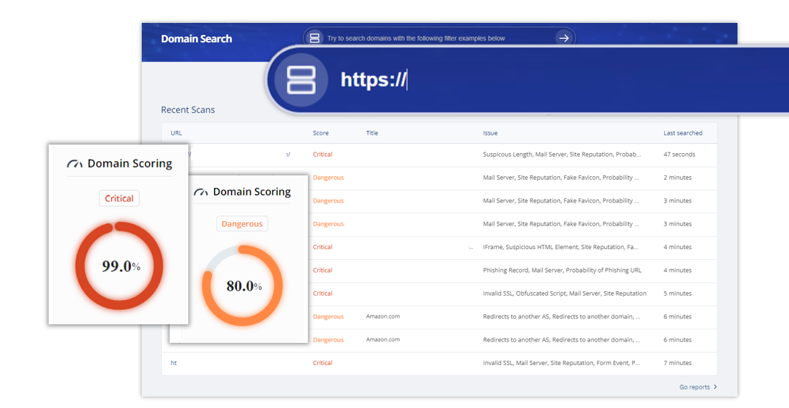
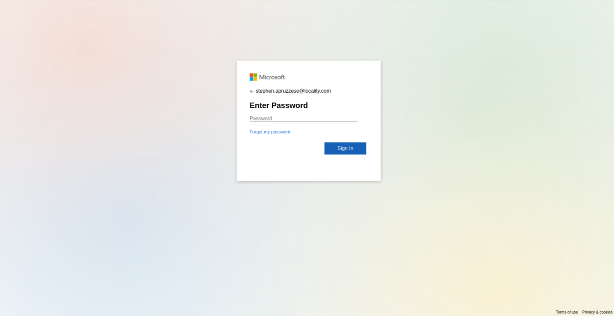

# 🌐 CriminalIP-Daily-Mal-Phishing

This repository provides a **daily list of malicious or phishing URLs** collected via Criminal IP's Domain Search. It is hosted on the official Criminal IP GitHub, offering a direct window into our extensive threat intelligence data. By presenting a sample of our complete dataset, we aim to raise awareness about potential online threats and encourage users to explore our full range of threat intelligence services.

> [!NOTE]
> For a **comprehensive security response** with expanded threat insights, contact us at [Criminal IP Contact Us](https://www.criminalip.io/contact-us) for samples and API access to our complete dataset.

---

## 🛠️ Overview

The URLs listed in this repository are randomly selected from those categorized as **Dangerous** or **Critical** in Criminal IP's Domain Search. Each day, a fresh batch of URLs is provided, which may include:
- Malicious websites
- Phishing sites
- Fraudulent domains

Criminal IP’s **AI-driven real-time detection** ensures a wide range of harmful sites are quickly identified and classified.

#### 🔗 Examples of Malicious Domains

---

## 🎯 Criteria for URL Selection

- **Score**: URLs with a score of "Dangerous" or "Critical."
- **Additional Conditions**: As defined by senior threat analysts.

---

## 🗂️ Data Fields

The following fields are included in the daily list:

| **Field**      | **Description**                                             |
|----------------|-------------------------------------------------------------|
| **Title**      | The webpage title of the malicious or phishing site          |
| **URL**        | The URL of the malicious or phishing site                    |
| **Score**      | The threat score assigned to the domain                      |
| **Country**    | The country where the domain is registered or originates     |
| **reg_dtime**  | The date and time the domain was registered                  |

---

## 📅 Example of Daily URLs List

Below is an example of the daily list format:

| **Title**               | **URL**                                                                                                            | **Score**  | **Country**   | **reg_dtime**   |
|-------------------------|--------------------------------------------------------------------------------------------------------------------|------------|---------------|-----------------|
| "business-credit-cards-31857.bond" | [http://business-credit-cards-31857.bond](https://www.criminalip.io/domain/report?scan_id=16051018) | Critical | US | 2024-10-08 02:30:29 (UTC) |
| "ekoloco.com" | [http://ekoloco.com](https://www.criminalip.io/domain/report?scan_id=16051057) | Critical | N/A | 2024-10-08 02:33:19 (UTC) |
| "Oops! This project isn't running." | [http://enthusiastic-sepia-hourglass.glitch.me](https://www.criminalip.io/domain/report?scan_id=16051067) | Low | US | 2024-10-08 02:34:04 (UTC) |

---

> [!TIP]
> For additional resources, please refer to the below:
> - Additional Code Examples: **[GitHub Reference Page](https://www.criminalip.io/developer/github-reference)**
> *This page provides you with multiple code usage references using the resources of Criminal IP such as API, search queries and etc., both from Criminal IP itself and actual user base.*
> - Chrome Extension: **[Criminal IP: AI-based Phishing Link Checker](https://www.criminalip.io/products/chrome-extension)**
> *This Chrome extension automatically scans and blocks malicious domains on your browser based on the threat intelligence of Criminal IP, ensuring a safer internet surfing experience.*
